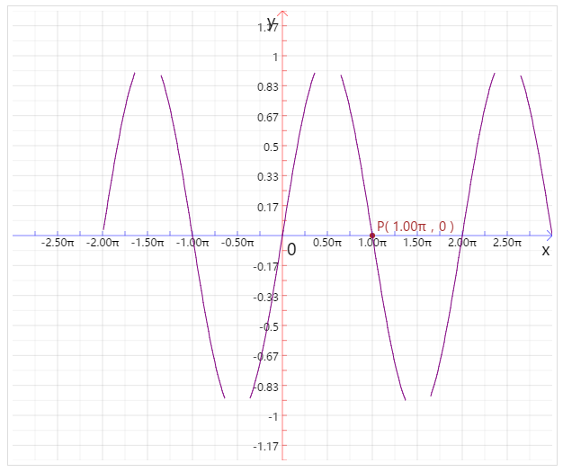
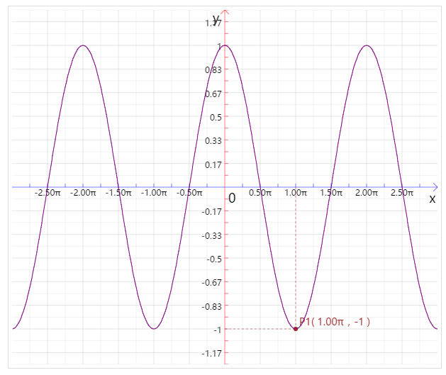
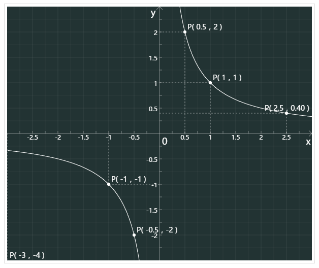
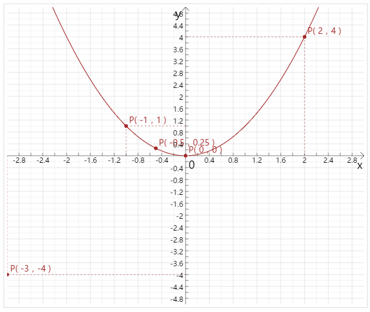
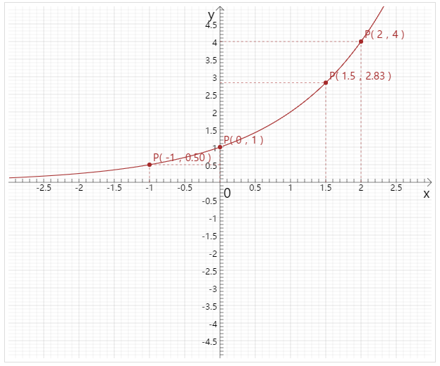
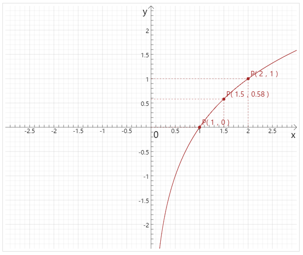

## 只是用来画函数图像的

#### 默认参数
```javascript
options = {
    width:600,
    height:400,
    backgroundColor:"white",//背景色
    animation:true,//是否显示动画
    xUnit:{ //x轴单位
        pixel:100,//一个单位有多少像素
        value:1,//单位值
        mince:1,//将一个单位细分为多少，值越大，精度越高，默认为1，即不细分
        step:1,//步长，多少步显示一次单位值
          convert:function (value) {//单位转换
            return value;
          },
          parse:function (value) {//单位逆转换
            return value;
          },
        suffix:"",//单位后缀
    },
    yUnit:{ //y轴单位
        pixel:100,//一个单位有多少像素
        value:1,//单位值
          mince:1,
        step:1,//步长，多少步才显示单位
          convert:function (value) {//单位转换
              return value;
          },
          parse:function (value) {//单位逆转换
              return value;
          },
          suffix:"",//单位后缀
    },
    showScale:true,//是否显示刻度
    scaleLen:5,//刻度长度
    scaleFontSize:12,//刻度字体大小
    coorTextColor:"black",//坐标轴字体颜色
    x0yFontSize:18,
    color:"black",//函数图像颜色
    hCoorColor:"black",//横坐标颜色
    vCoorColor:"black",//纵坐标颜色
    coorLineWidth:0.5,//坐标轴线宽
    coorArrowLen:8,//坐标轴箭头长度
    showGrid:true,//是否显示网格
    gridColor:"gray",//网格颜色
    gridLineWidth:0.2,//网格线宽，如果x、y坐标步长(step)大于1，那么步长之内的线宽为一半
    points:[],//要标记的点,格式:{x:x,y:y,showDotted:true|false,mark:'P'} 若不提供y,则系统自动根据函数计算y,默认显示虚线
    markPointLineWidth:0.5,//描点的虚线线宽
    markPointRadius:3,//描点 点的半径
    markPointColor:"brown",//描点颜色
    markPointFontSize:14,
    //定义域，如果x!=0,函数返回x!=0即可
    domain:function (x) {
        return true;
    },
    //值域
    range:function (y) {
        return true;
    },
    //要绘制的函数
    fun:function (x) {
        return x;
    }
};
```

#### 下面是6个小栗子

##### 1.正弦函数
* code
```javascript
new GraphFunction({
    canvas: document.getElementById("canvas1"),
    width: 600,
    height: 500,
    xUnit: {
        pixel: 100,//表示一个单位有100个像素,默认值100
        value: Math.PI,//表示一个单位的值为一个π,默认为1
        step:2,//步长，多少步显示一次单位值，默认为1
        mince:4,//将一个单位细分为4份，值越大，精度越高，默认为1，即不细分
        convert:value=>(value/Math.PI).toFixed(2),//转换单位显示的格式，这里将单位转换为 π的倍数 的格式
        parse:value=>value*Math.PI,//单位逆转换,作用是在标记点时，转换单位
        suffix:"π"//单位后缀
    },
    yUnit: {
        pixel: 200,
        mince:12,
        step:2,
        value:1,
    },
    //标记点,若不指定y,那么y系统自动根据函数计算，默认显示虚线，默认点符号为“P”
    points: [ {x: 1,showDotted: false}],
    color: "purple",//函数曲线颜色，默认黑色
    vCoorColor: "red",//纵坐标颜色，默认黑色
    hCoorColor: "blue",//横坐标颜色，默认黑色
    fun: x => Math.sin(x),//要绘制的函数表达式：y = sin(x)，默认函数为y = x
    domain:x=>x>-2,//定义域
    range:y=>y>=-0.9&&y<0.9//值域
});
```
* result：   
 

##### 2.余弦函数
* code
```javascript
new GraphFunction({
    canvas: document.getElementById("canvas2"),
    width: 600,
    height: 500,
    xUnit: {
        pixel: 100,//表示一个单位有100个像素,默认值100
        value: Math.PI,//表示一个单位的值为一个π,默认为1
        step:2,//步长，多少步显示一次单位值，默认为1
        mince:4,//将一个单位细分为4份，值越大，精度越高，默认为1，即不细分
        convert:value=>(value/Math.PI).toFixed(2),//转换单位显示的格式，这里将单位转换为 π的倍数 的格式
        parse:value=>value*Math.PI,//单位逆转换,作用是在标记点时，转换单位
        suffix:"π"
    },
    yUnit: {
        pixel: 200,
        mince:12,
        step:2,
        value:1,
    },
    //标记点,若不指定y,那么y系统自动根据函数计算，默认显示虚线，默认点符号为“P”
    points: [{x: 1, mark: 'P1'}],
    color: "purple",//函数曲线颜色，默认黑色
    vCoorColor: "red",//纵坐标颜色，默认黑色
    hCoorColor: "blue",//横坐标颜色，默认黑色
    fun: x => Math.cos(x),//要绘制的函数表达式：y = cos(x)，默认函数为y = x
});
```
* result：   
 

##### 3.反比例函数
* code
```javascript
new GraphFunction({
    canvas: document.getElementById("canvas3"),
    width: 600,
    height: 500,
    xUnit: {
        pixel: 100,//表示每50/10 = 5像素为一个单位，值越小，刻度越精细
        value: 1,//表示一个单位的值为1/10 = 0.1
        mince:4,
        step:2,
    },
    yUnit: {
        pixel: 100,//表示每50/10 = 5像素为一个单位，值越小，刻度越精细
        value: 1,//表示一个单位的值为1/10 = 0.1
        mince:4,
        step:2,
    },
    color: "white",//函数曲线颜色，默认黑色
    vCoorColor: "#ddd",//纵坐标颜色，默认黑色
    hCoorColor: "#ddd",//横坐标颜色，默认黑色
    backgroundColor: "#233",//背景色，默认白色
    coorTextColor: "white",//坐标轴的字体颜色
    //标记点,若不指定y,那么y系统自动根据函数计算，默认显示虚线，默认点符号为“P”
    points: [{x: 1}, {x: 0.5}, {x: 2.5}, {x: -1}, {x: -0.5, showDotted: false}, {x: -3, y: -4}],
    markPointColor: "white",//标记点的颜色，包括虚线、原点及点坐标的文本颜色，默认棕色
    fun: x => 1 / x,//要绘制的函数表达式：y = 1/x ，默认函数为y = x
    domain: x => x !== 0,//要绘制函数的定义域
});
```
* result：   
 

##### 4.二次函数
* code
```javascript
new GraphFunction({
    canvas: document.getElementById("canvas4"),
    width: 600,
    height: 500,
    xUnit: {
        pixel: 100,
        value: 1,
        mince:5,
        step:2,
    },
    yUnit: {
        pixel: 50,
        value: 1,
        mince:5,
        step:2,
    },
    color: "brown",//函数曲线颜色，默认黑色
    //标记点,若不指定y,那么y系统自动根据函数计算，默认显示虚线，默认点符号为“P”
    points: [{x: 0}, {x:2}, {x: -1}, {x: -0.5, showDotted: false}, {x: -3, y: -4}],
    fun: x => x * x,//要绘制的函数表达式，默认函数为y = x
});
```
* result：   
 

##### 5.指数函数
* code
```javascript
new GraphFunction({
    canvas: document.getElementById("canvas5"),
    width: 600,
    height: 500,
    xUnit: {
        pixel: 100,
        value: 1,
        mince:10,
        step:5,
    },
    yUnit: {
        pixel: 50,
        value: 1,
        mince:10,
        step:5,
    },
    color: "brown",//函数曲线颜色，默认黑色
    //标记点,若不指定y,那么y系统自动根据函数计算，默认显示虚线，默认点符号为“P”
    points: [{x:-1},{x: 0},{x:2},{x:1.5}],
    fun: x => Math.pow(2,x),//要绘制的函数表达式：y=2^x，默认函数为y = x
});
```
* result：   
 

##### 6.对数函数
* code
```javascript
new GraphFunction({
    canvas: document.getElementById("canvas6"),
    width: 600,
    height: 500,
    xStep: 1 / 50,//横坐标表示每50个像素为1
    yStep: 100,//纵坐标表示每50个像素为一个单位1
    xUnit: {
        pixel: 100,
        value: 1,
        mince:10,
        step:5,
    },
    yUnit: {
        pixel: 100,
        value: 1,
        mince:10,
        step:5,
    },
    color: "brown",//函数曲线颜色，默认黑色
    //标记点,若不指定y,那么y系统自动根据函数计算，默认显示虚线，默认点符号为“P”
    points: [{x:1},{x: 0},{x:2},{x:1.5}],
    fun: x => Math.log2(x),//要绘制的函数表达式(如果底数为0.5,运用换底公式：y = Math.log(x)/Math.log(0.5))
    domain:x=>x>0
});
```
* result：   
 

